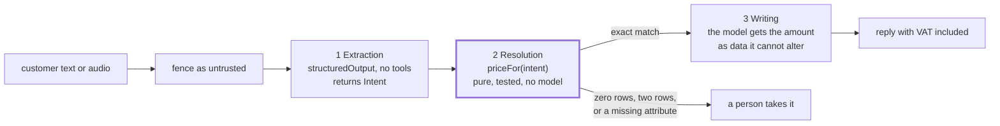
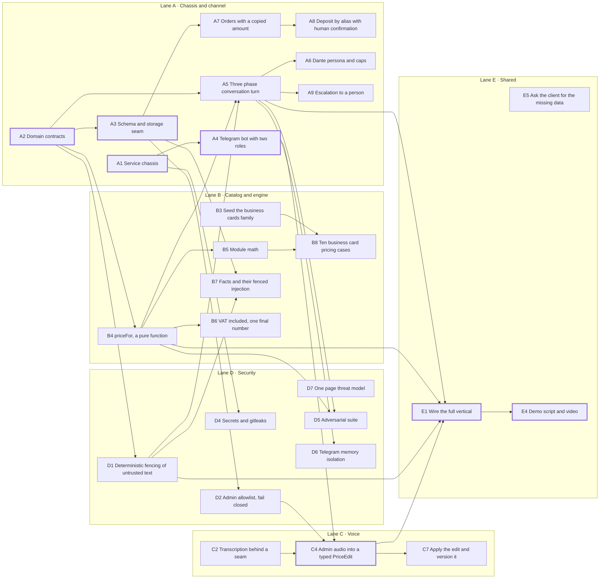
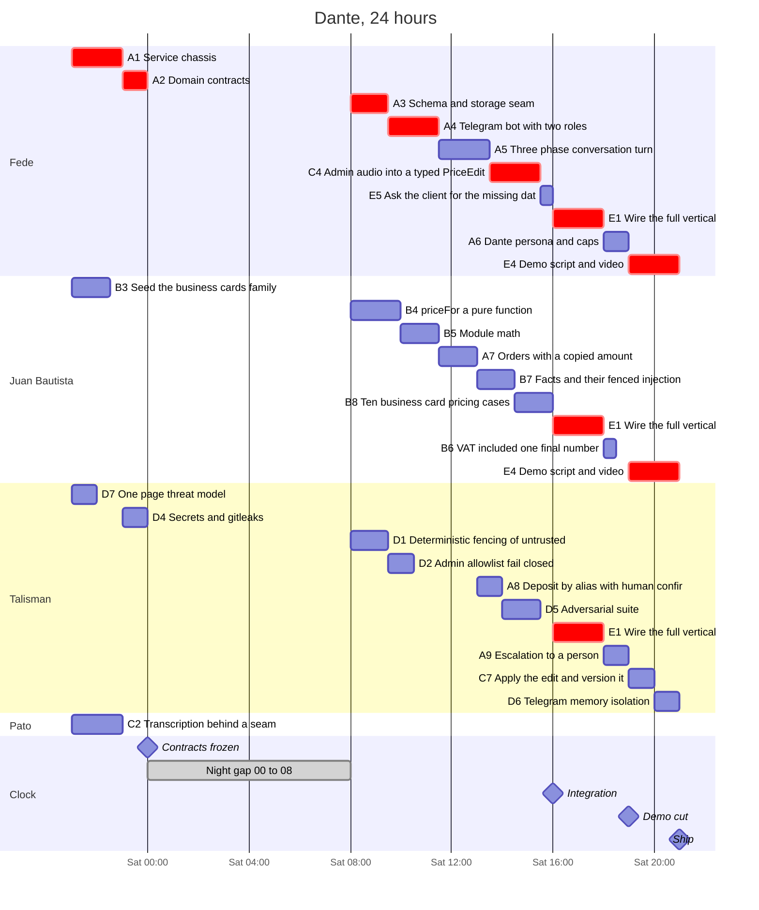

# Schedule

Friday 2026-09-11 21:00 to Saturday 21:00. Nobody works between 00:00 and 08:00, so the
window holds sixteen working hours, not twenty four. Twenty seven tickets, twelve cut.

## The turn

Three phases. The middle one never sees a model, which is the whole product.

## Who blocks whom

Arrows point at the ticket that waits. The chain in bold decides whether the demo exists.

## Run sheet

## What the schedule says

Pato's three hours were fully blocked. As written, storing a voice note needed the Telegram
bot, which needed the chassis: four hours of Fede's work before Pato could touch anything. The
transcription seam does not need Telegram, it needs a file, so C2 moved to the front of the
lane and Pato spends Friday night on it.

Friday night only fits work with no upstream. Twelve person-hours exist before midnight and
almost every ticket is blocked at hour zero. The four that are not: the chassis, the type
contracts, the seed rows typed off the price list, and the threat model. Anything else
scheduled on Friday is someone watching a branch compile.

Integration is pinned, not queued. Left to the dependency graph, wiring the vertical started
at 20:00 and the demo never got recorded. E1 is nailed to 16:00 and E4 to 19:00, and lane work
fills around them. That is the difference between a demo and a repo.

Fede is booked 16 hours out of 16, because he absorbs the voice lane at midnight. Everyone
else has slack. If anything slips, he is the one who falls.
